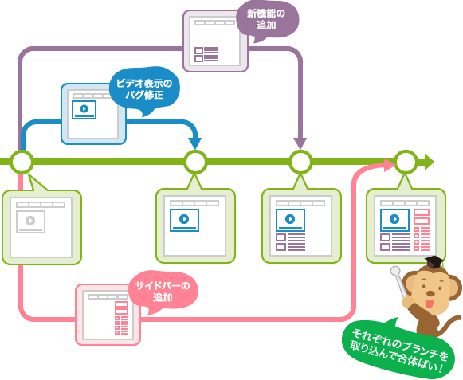

# Gitについて
開発案件でGitを使用します。Gitの使い方が理解できないと案件に入れないため、こちらでGitの基礎力を上げていきましょう。

## Gitとは
### Git
プログラムのコードが書かれているソースファイルのバージョンを管理するツール
### GitHub
Web上でソースコードを保存、共有、公開することができるサービス
### 意義
チーム開発に適した機能を付け加えたサービスが**GitHub**です。
プロジェクトのバグ管理に使える**Issues**や、コードレビューを効率化する**Pull Request**などのチーム開発に役立つ機能が、Web上から使えるようになるためGitHubが使われることが多いです。 
 
引用：[チーム開発を変える「GitHub」とは？導入方法・使い方を徹底解説！【第1回】【導入編】](https://seleck.cc/630)

## チーム開発の流れについて
### チーム開発の流れ
#### 0. （管理者は）リモートリポジトリにてリポジトリの作成
#### 1. リポジトリのClone
- 対象のリモートリポジトリをローカル（自身のPC）にクローンする（最初のみ実行）
- コマンド`git clone [リポジトリURL]`を使用してリモートリポジトリを複製する
#### 2. ブランチの作成
- ローカルブランチを作成
- デフォルトブランチから新たなブランチを作成し、開発環境を準備
- デフォルトブランチは、「main」「master」「develop」であることが多い
#### 3. コーディング
- ファイルを作成し、コードを記述し実装作業を進める
#### 4. リポジトリへPush
- リモートリポジトリへ**Push**
#### 5. Pull request
- GitHubサイトから**Pull request**
#### 6. マージ
- 変更内容に問題なければ、リモートブランチにマージ・統合
#### 7. pull
- ローカルリポジトリのリモートブランチに移動し、最新の状態を取り込む

### ブランチとは
履歴の流れを分岐して記録していくためのものです。分岐したブランチは他のブランチの影響を受けないため、同じリポジトリ中で複数の変更を同時に進めていくことができます。そして作業の終わったメンバーは、メインのブランチに自分のブランチの変更を取り込んでいきます。このようにすることで、他のメンバーの作業による影響を受けることなく、自分の作業に取り込むことができます。

 
引用：[ブランチとは](https://backlog.com/ja/git-tutorial/stepup/01/)

## Gitコマンド
### clone
リモートリポジトリをローカルに複製するコマンド 
`git clone [リモートリポジトリURL]`

### remote
リモートリポジトリの詳細を表示するコマンド 
`git remote -v`

### checkout
ブランチを移動するコマンド 
`git checkout [ブランチ名]` 
新しくブランチを作成し、移動するコマンド 
`git checkout -b [ブランチ名]`

### switch
ブランチを移動するコマンド 
`git switch [ブランチ名]` 
新しくブランチを作成し、移動するコマンド 
`git switch -c [ブランチ名]`

### branch
ローカルブランチを確認するコマンド 
`git branch` 
デフォルトブランチを含んだブランチの一覧を表示するコマンド 
`git branch -a` 
ローカルブランチを作成するコマンド 
`git branch [ブランチ名]`

### add
変更したファイルをステージングに追加するコマンド 
`git add .` 
変更した特定ファイルのみステージング方法 
`git add [特定ファイル名]`

### commit
コミットを作成するためのコマンド 
`git commit -m “[コミットメッセージ]”`

### push
デフォルトブランチの内容をリポジトリにプッシュするコマンド 
`git push origin [デフォルトブランチ]` 
ローカルブランチの内容をリポジトリにプッシュするコマンド 
`git push origin [ローカルブランチ]`

### pull
リポジトリの最新の状態をローカルに反映させるためのコマンド 
`git pull origin [デフォルトブランチ]`

## 具体例
1. デスクトップ上に空のフォルダを用意
2. GitHub上でNew repositoryをREADME付きで作成
3. VS codeで空のフォルダを開いてターミナルでクローンする
4. 空のフォルダからcdコマンドでクローンしたリポジトリに移動する
5. ブランチを切って開発環境を準備
6. htmlファイルを作成し、コードを記述
7. gitコマンドでリモートリポジトリの作業ブランチにプッシュ
8. Pull requestを送る
9. 問題なければmergeする
10. ローカルのブランチをmainに移動しgit pullする