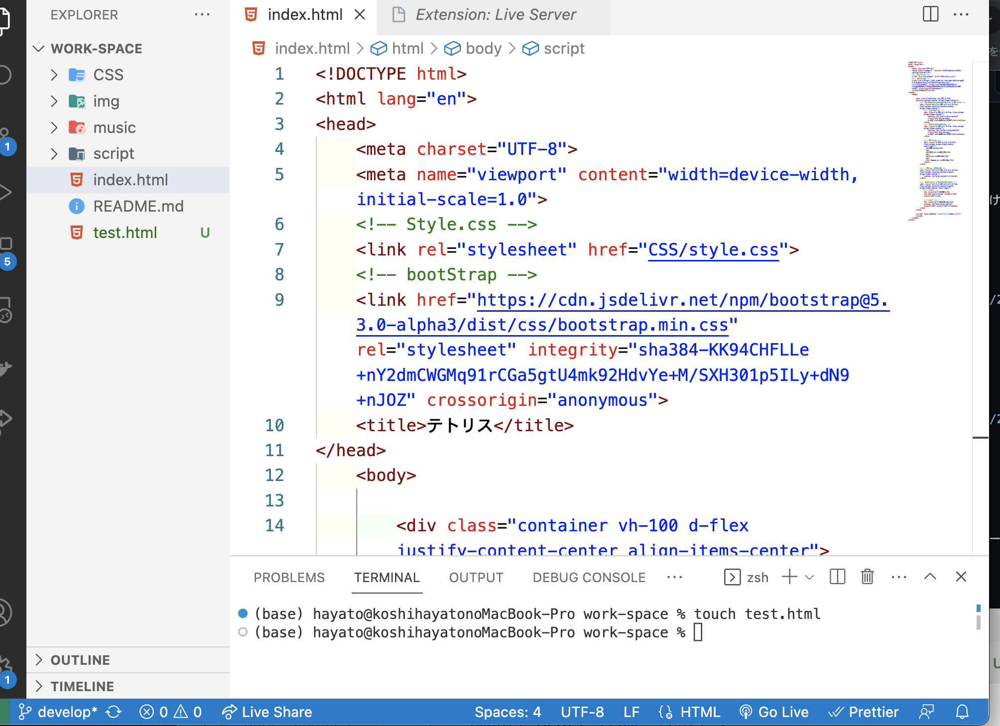
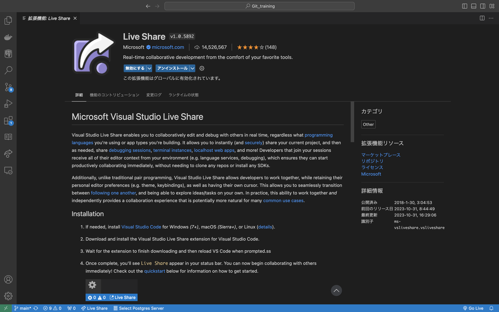

# チーム開発で使う便利機能について

## LiveServerの使い方

### サーバー作成について
以前まではChromeのタブににindex.htmlを表示することでweb上での挙動を見ながら開発ができましたが、現状それが不可能になりました。そのためアプリケーションを作る際にはサーバーを立てる必要があります。そこで使用するのがvscodeの拡張機能のLiveServerです。

### 手順
1. 拡張機能を追加する

2. 画面右下、Go Liveをクリックする

## LiveShareの使い方
### 手順
1. 拡張機能を追加する

