# チーム開発で使うリポジトリの作成方法

## 概要
1. Organizationの作成とメンバーの招待
2. チーム開発用リポジトリの作り方
3. ブランチの作成方法(developブランチの作成)
4. デフォルトブランチの設定方法(developブランチをデフォルトブランチに設定する)

# (注記)以下、Recursionの資料をもとに作成しています。

## 1.　Organizationの作成とメンバーの招待
## Organizationの説明
Organizationとは、複数のリポジトリをさまざまなユーザーで管理、および共同作業するための機能です。

参考図
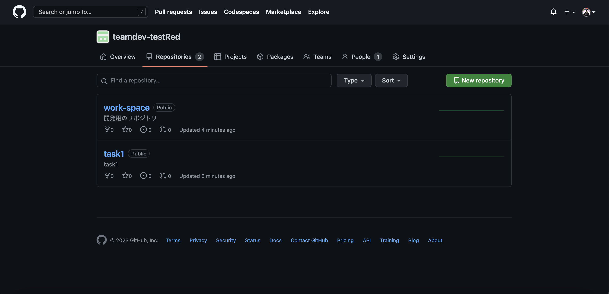

### 作成手順
### ①アイコンマークをクリック
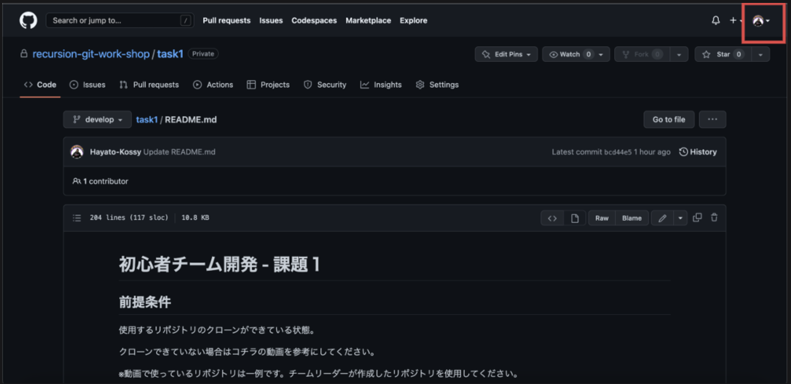

### ②settingsをクリック
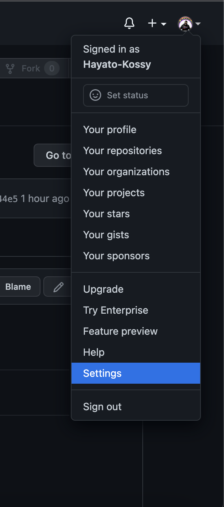

### ③Organizationsをクリック
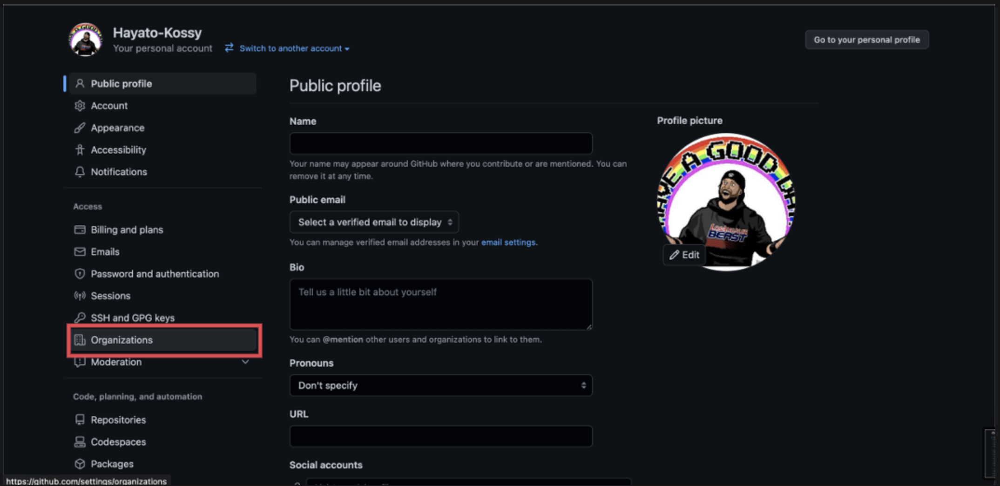

### ④New oraganizationをクリック
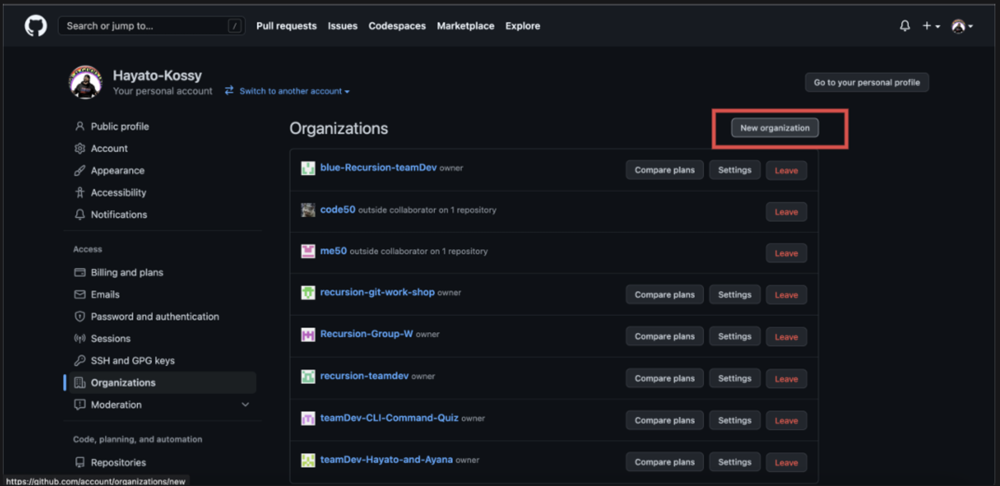

### ⑤free planを選択
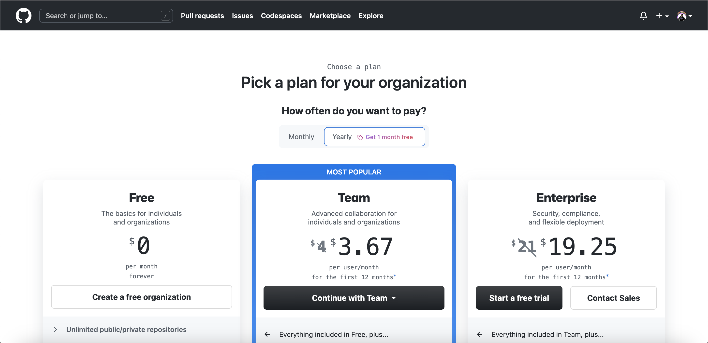

### ⑥oraganizationを作成
※名前は任意で決めることができます
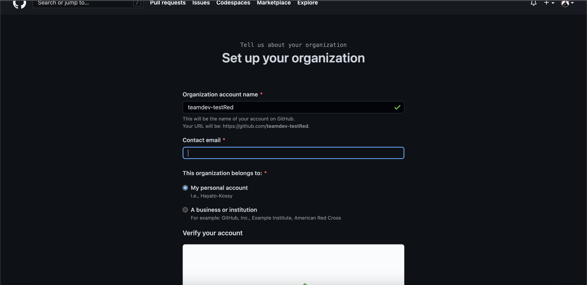

### ⑦invite memberをクリックし、チームメンバーを検索、owner権限で招待する(メンバーの招待はいつでもできます)
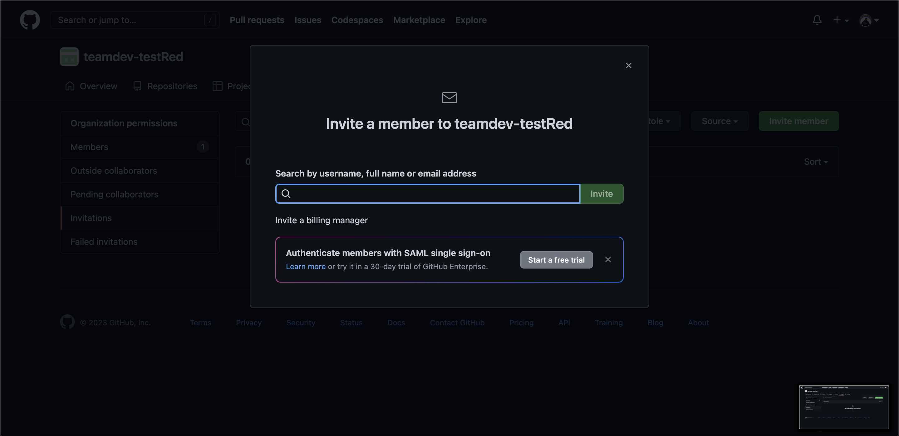
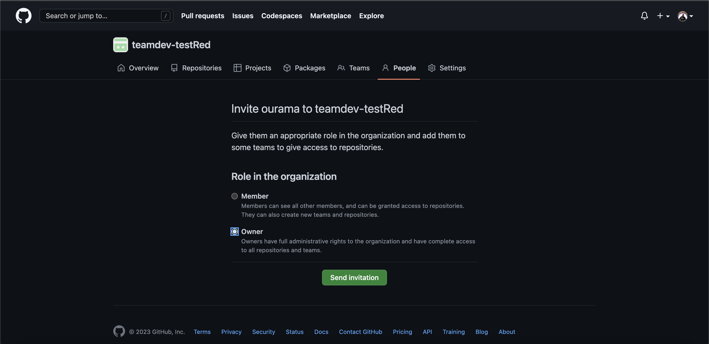

## 2.　チーム開発用リポジトリの作り方
チームリーダーは、task1という課題用のリポジトリとwork-spaceという開発用のリポジトリ、これら２つのpublicリポジトリを作っていただきます。

完成図としてはこのようになります。

### リポジトリの作成方法

①new repositoryをクリック
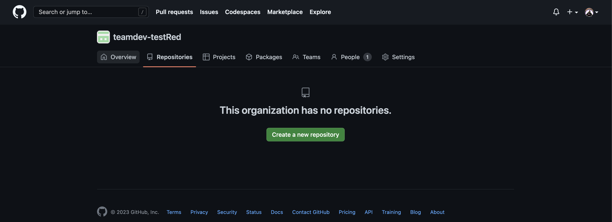

②publicを選択
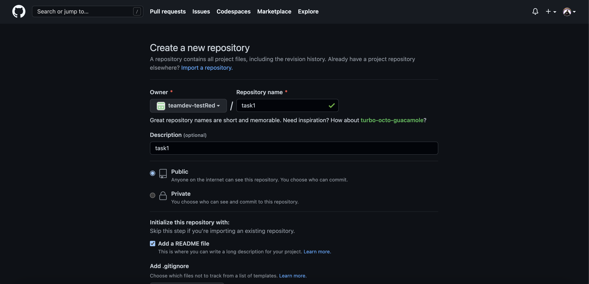

③２つ目のリポジトリからは画面右のnew repositoryをクリック
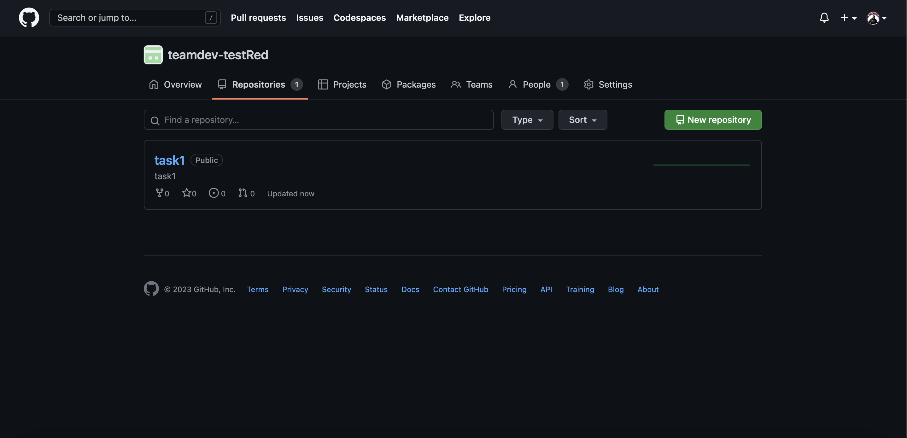

## 3.　ブランチの作成方法
### ①branchをクリック
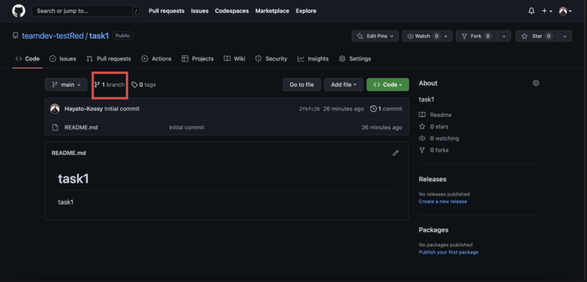

### ②画面右、new branchをクリック
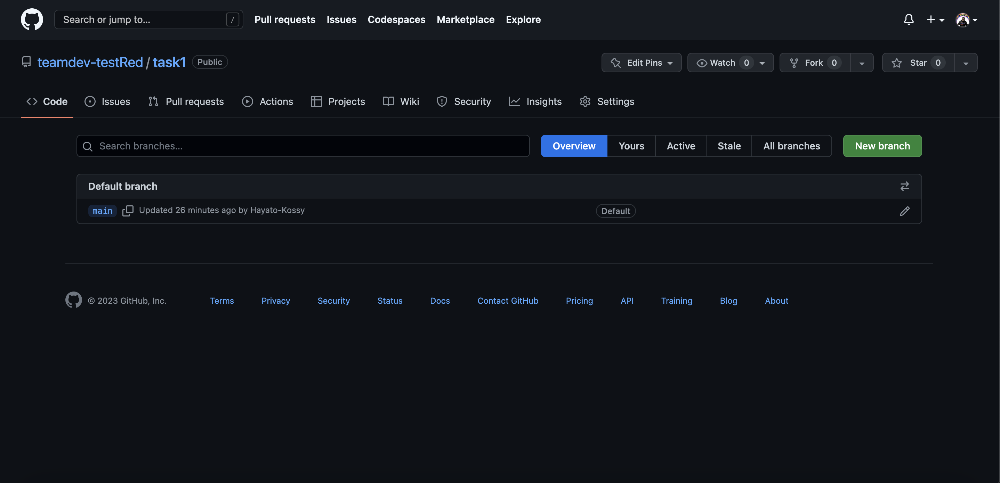

### ③ブランチ名はdevelopで作成（今回の開発では全リポジトリに以下の設定を適用してください）
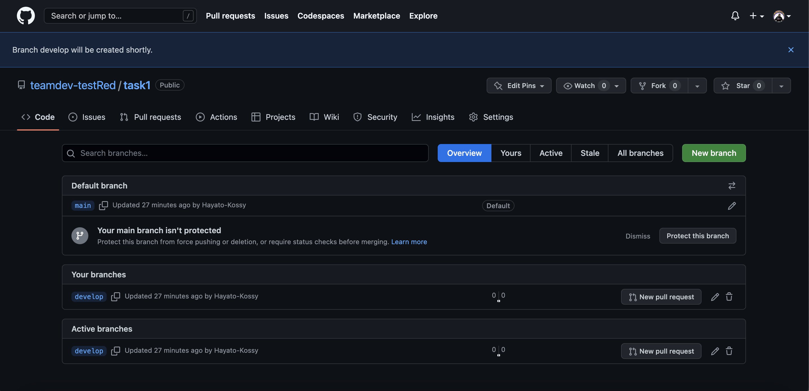

## 4.　デフォルトブランチの設定方法（今回の開発では全リポジトリに以下の設定を適用してください）

### ①settingsをクリック後、branchesをクリック
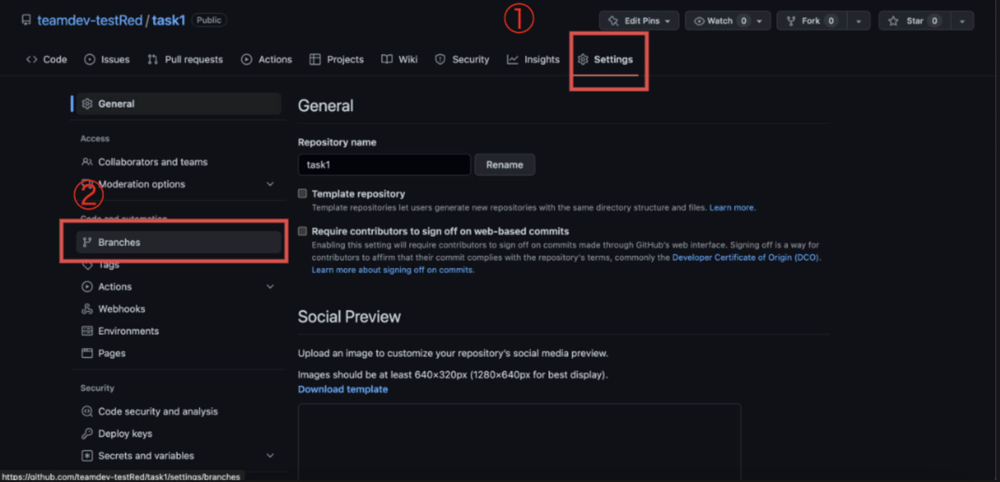

### ②矢印マークをクリック後、ブランチをmainからdevelopに変更
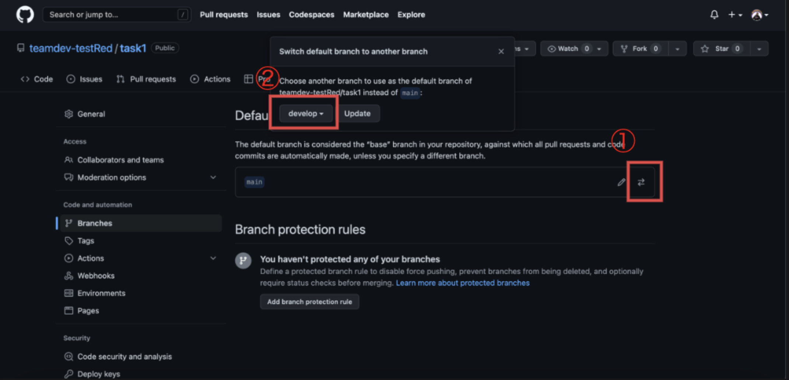