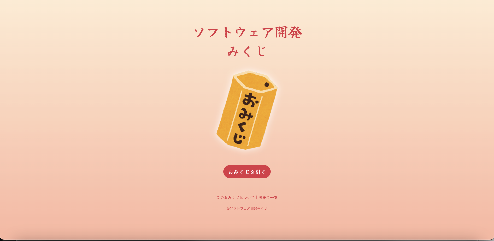
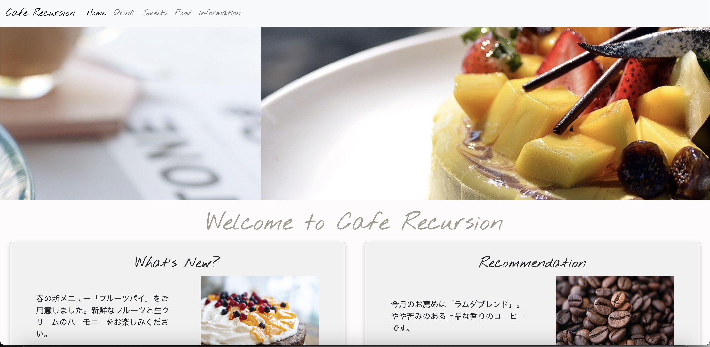
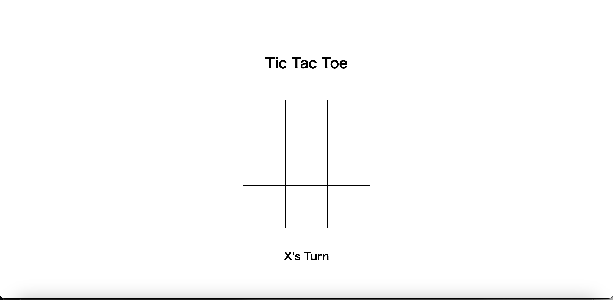
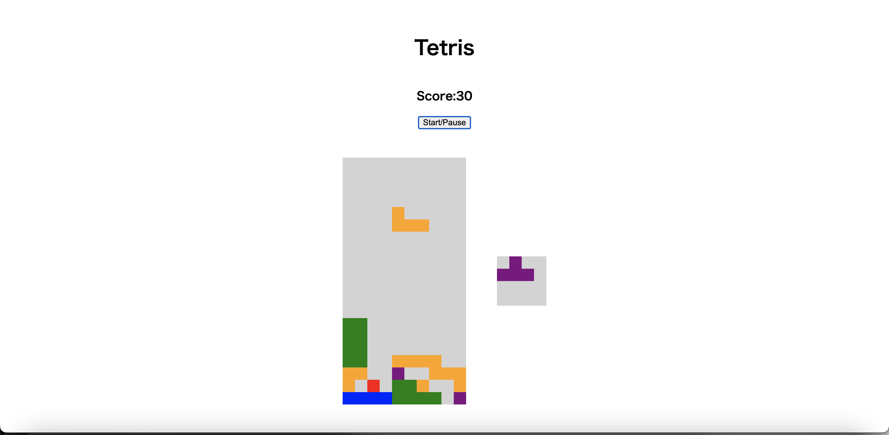

# 開発

## 作成のルール
開発物は自由課題、もしくは次の４つから好きなものを選んでもらいます。

文言や画像は著作権を侵害しない限り好きなものを使用してOKです。

余裕のあるチームは、自由にカスタマイズしていただいても結構です。

## 開発物一覧
### ① [おみくじ](https://acha0203.github.io/SW_Dev_Omikuji/)

要件：トップページのボタンをクリックすると各おみくじがランダムで表示される。

レベル 1：大吉や中吉などの各おみくじのページのオリジナル版を HTML/CSS/Bootstrap で作成

レベル 2：JavaScript を使って見本どおりに作成

### ② [Cafe Recursion Home Page](https://acha0203.github.io/Cafe-Recursion/)

要件：トップページにスライダーアニメーションを配置する。

レベル 1：スライダーなしで作成

レベル 2：見本どおりに作成

レベル 3：見本にはないメニューのページやリンクなども作成

### ③ [Tic Tac Toe](https://tictactoe-tkwonn.vercel.app/)

要件：三目並べゲームを作成する。

余裕のある方：

- localStorage保存可能
- CPU対戦
- アニメーションを加える
- [Ultimate Tic Tac Toe](https://ja.wikipedia.org/wiki/%E3%82%B9%E3%83%BC%E3%83%91%E3%83%BC%E3%80%87%C3%97%E3%82%B2%E3%83%BC%E3%83%A0)として作成等

### ④ [Tetris](https://tetris-tkwonn.vercel.app/)

要件：テトリスを作成する。

余裕のある方：

- ハードドロップ、・スーパーローテーション、ホールド機能
- 次にプレイフィールドに入るピース（複数可）を表示
- ピースの着地点予想をユーザに表示する
- 過去のトップスコアと現在プレイしているゲームのスコア表示
- アニメーションを加える等

### ⑤ 自由課題

要件：テーマ決めからチームで行い、開発とデプロイまで行う
